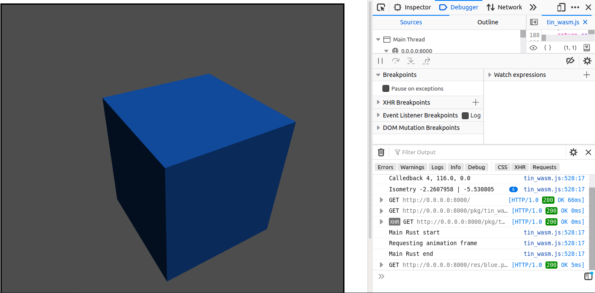

# Rust Wasm playground (using bindgen, web_sys)

## Quickstart

See https://tinmarino.github.io/tin_wasm

## Install and Run

```bash
# Fetch <- internet
git clone https://github.com/tinmarino/tin_wasm.git && cd tin_wasm.git

# Install wasm pack
sudo apt install cargo
cargo install cargo-wasm

# Build -> pkg
wasm-pack build --debug --target web

# Run index.html
python3 -m http.server
firefox http://0.0.0.0:8000/
```

## "Play"

* __translate__: wasd (and rf)
* __rotate__: arrow keys



## Dev

```
├── index.html            <- 1
├── src/
    ├── lib.rs            <- 2
    ├── game.rs           <- 3
    ├── camera.rs         <- 5
    ├── util.rs           <- 4
    ├── constants.rs

├── Cargo.toml
├── README.md
├── res/
├── pkg/
├── target/
```
